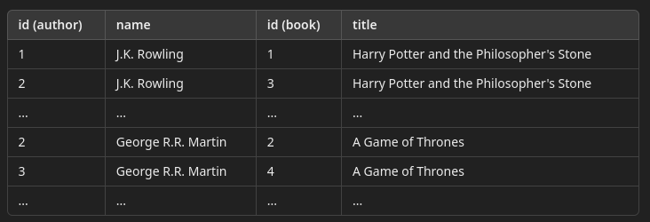
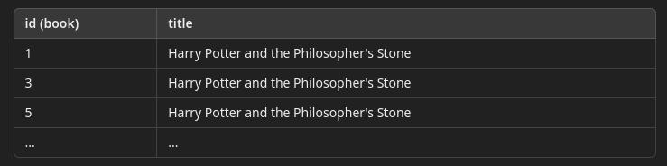
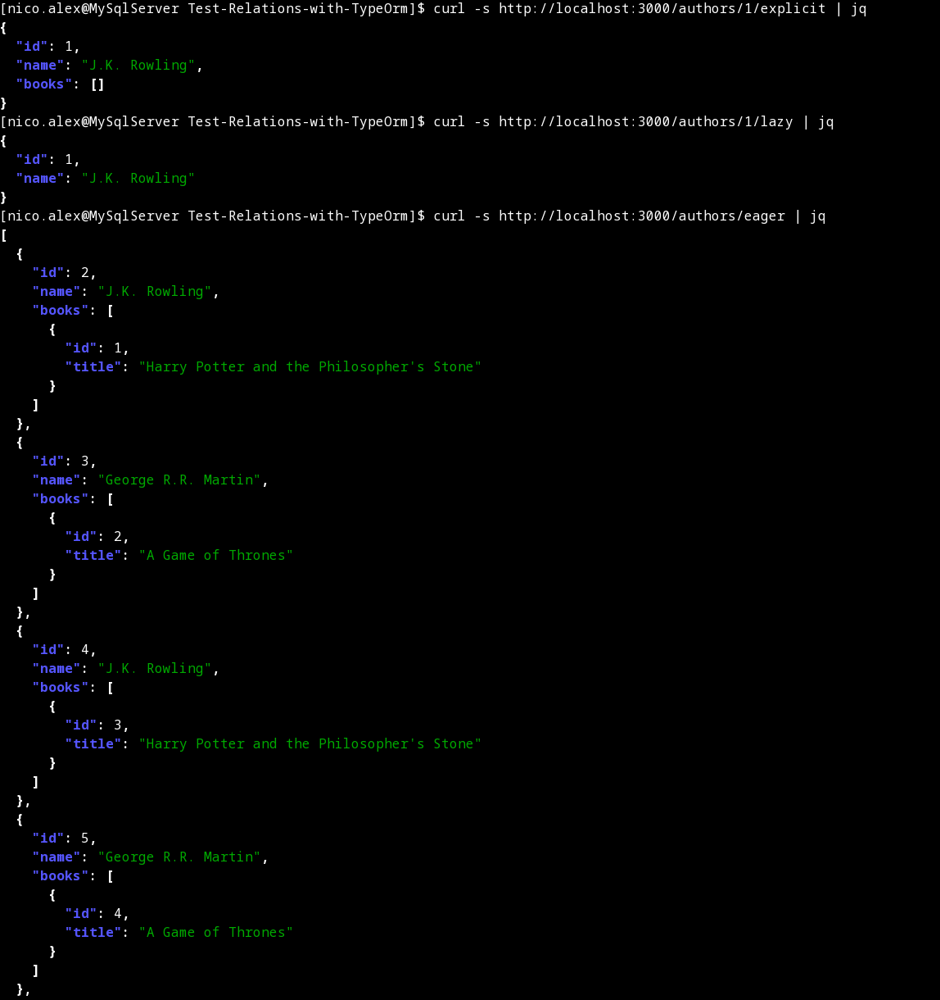
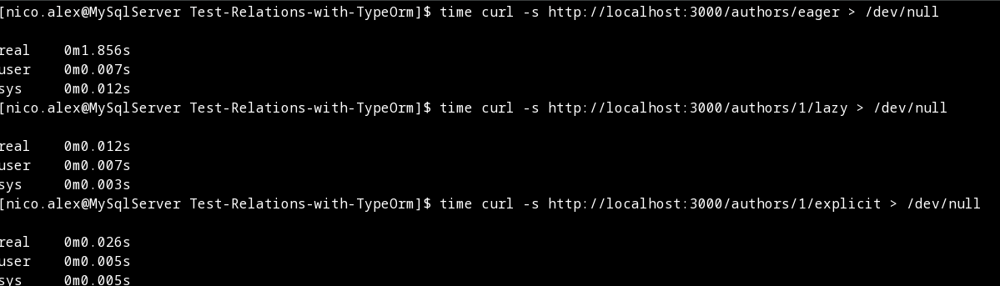

# Eager VS Lazy VS Explicit

Ce rapport est un compte rendu de la phase de test du chargement des relations de manères différentes: explicit, eager, et lazy.

## Eager Loading

Cette méthode charge toutes les entités liées d'une seule requête lorsque l'entité principale est récupérée.
Cela réduit le nombre de requêtes SQL, mais peut entraîner un chargement excessif de données, augmentant la consommation de mémoire.

## Lazy Loading

Cette approche ne charge les entités liées que lorsqu'elles sont explicitement demandées.
Cela permet d'économiser des ressources en ne chargeant que les données nécessaires, mais peut entraîner plusieurs requêtes supplémentaires si les données liées sont souvent accédées.

## Explicit Loading

Dans cette méthode, on décide manuellement quand charger les entités liées.
Cela offre un contrôle total sur le processus de chargement, permettant d'optimiser les performances, mais augmente la complexité du code et nécessite une gestion plus rigoureuse.

## Avantages et Inconvénients
| Type               | Avantages                                  | Inconvénients                                  |
|--------------------|--------------------------------------------|------------------------------------------------|
| **Eager Loading**   | - Moins de requêtes SQL<br>- Chargement rapide de toutes les données liées | - Chargement potentiellement excessif<br>- Plus de consommation mémoire si beaucoup de relations |
| **Lazy Loading**    | - Charge les données au besoin<br>- Moins de données chargées au départ | - Multiple requêtes SQL si mal utilisé (N+1 problem) |
| **Explicit Loading**| - Contrôle total sur les données chargées<br>- Performances optimisées si bien implémenté | - Plus complexe à gérer pour le développeur<br>- Risque de chargement manuel inefficace |


## Exemple décomposé pour chaque type

**Prennons un exemple avec cette base de données**
## Table: Author

| id |        name         |
|----|---------------------|
|  1 | J.K. Rowling        |
|  2 | J.K. Rowling        |
|  3 | George R.R. Martin  |
|  4 | J.K. Rowling        |
|  5 | George R.R. Martin  |


## Table: Book

| id |                  title                            | authorId |
|----|--------------------------------------------------|----------|
|  1 | Harry Potter and the Philosopher's Stone         |        1 |
|  2 | A Game of Thrones                                |        2 |
|  3 | Harry Potter and the Philosopher's Stone         |        3 |
|  4 | A Game of Thrones                                |        4 |
|  5 | Harry Potter and the Philosopher's Stone         |        5 |

### Eager Loading

L'eager loading permet de charger les données associées (par exemple, les livres d'un auteur) en une seule requête.
Cela signifie que l'on peut récupéré tous les auteurs avec leurs livres dans une seule opération.

**Exemple SQL**
```
SELECT author.*, book.* 
FROM author 
JOIN book ON author.id = book.authorId;
```

On obtient une liste où chaque ligne contient les informations d'un auteur ainsi que le titre de son livre.



### Lazy Loading

Le lazy loading charge les données associées uniquement lorsqu'elles sont demandées.
Dans ce cas, on peut d'abord charger les auteurs, puis charger les livres seulement lorsque vous accédez à un auteur spécifique.

1) Charger d'abord les auteurs

```
SELECT * FROM author;
```

2) Ensuite si on veut obtenir les livres d'un auteur spécifique

```
SELECT * FROM book WHERE authorId = x;
```

Si on charge tous les auteurs, mais que l'on demande les livres pour un auteur spécifique (par exemple, J.K. Rowling), le résultat pour les livres serait:



### Explicit Loading
L'explicit loading implique de charger explicitement les données associées après avoir chargé l'entité principale. Vous chargez d'abord les auteurs, puis vous chargez les livres pour chaque auteur sur demande.

1) On charge d'abord les auteurs:
```
SELECT * FROM author;
```

2) Pour chaque auteur, on charge explicitement les livres:
```
SELECT * FROM book WHERE authorId = x;
```

Le résultat serait similaire à celui du lazy loading, mais ici, on a un contrôle explicite sur quand et comment charger les livres. On pourrait obtenir un résultat pour chaque auteur comme celui-ci:


## Résultat basé sur le code de ce repo



## Performances

**Pour une base de données de 200k books et 200k authors**

Le temps à prendre en compte est le temps "real"



